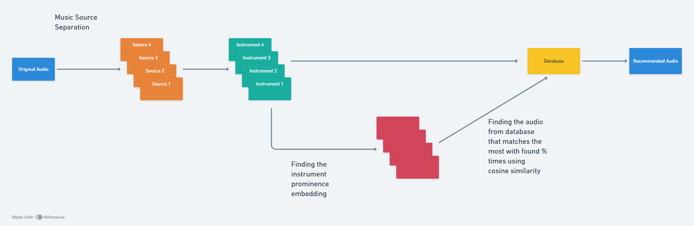
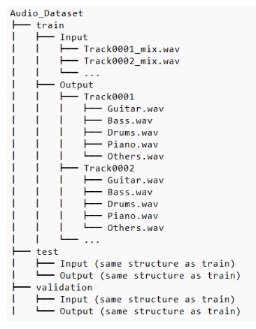

# DeepMelody: Personalized Music Recommendations Based on Instrumental Composition 


DeepMelody is a project that focuses on generating personalized music recommendations by analyzing the prominence of individual instruments in audio tracks. Using machine learning techniques, the project aims to provide users with tailored music recommendations based on their instrumental preferences.

## Project Overview

The core of this project uses the **Slakh2100 dataset**, a collection of labeled multitrack audio files containing various genres. We built a **U-Net-based model** for music source separation, isolating instrument spectrograms. From these spectrograms, we extract **instrument embeddings**, which represent the prominence of each instrument in a track. By calculating the cosine similarity between these embeddings, the system generates personalized music recommendations.

The project allows users to discover music based on specific instruments they enjoy, rather than being limited to genre-based suggestions.

## Key Features

- **Instrument Isolation:** Using a U-Net model, we isolate individual instrument spectrograms to analyze each instrument's prominence in the music.
- **Instrument Embeddings:** We create embeddings that capture the significance of each instrument, which allows for more personalized recommendations.
- **Personalized Music Recommendations:** Recommendations are based on similarity to a user’s instrumental preferences rather than traditional genre-based algorithms.
- **Ongoing Research:** We are researching ways to improve the embeddings of instrumental prominence for even better music recommendations.

### Project Workflow



## Getting Started

To get started with DeepMelody, follow these steps:

### Prerequisites

1. Python 3.x
2. Necessary libraries:
   - `Pytorch` 
   - `librosa`
   - `numpy`
   - `scikit-learn`
   - `matplotlib`
   - `pandas`

You can install the required libraries by running the following command:

```bash
pip install -r requirements.txt  
```
  
### Dataset

The project uses the Slakh2100 dataset, which can be downloaded from this [Link](slakh.com).

### Running the Project

- clone the repository

```bash
git clone https://github.com/shivamshinde123/Instrument-Based-Music-Recommendation.git
```

- Navigate to the Project Directory

```bash
cd Project-Directory-Name
```

- Dataset Folder: Keep the dataset in the folder named Slakh2100 with train, test and validation split.

- Dataset Folder structure should be as follows:  

    

- Consolidating the metadata

```bash
python src/step1_creating_csv.py
```

- Data Preprocessing (if data is not in required format)

```bash
python src/step_2_DatasetLoading.py
```

- Calculating database embedding matrix

```bash
python src/step3_calculate_similarity_scores.py
```

- Training the audio source separation model

```bash
python src/step4_ModelTraining.py
```

- Running the web application

```bash
streamlit run src/app.py
```
